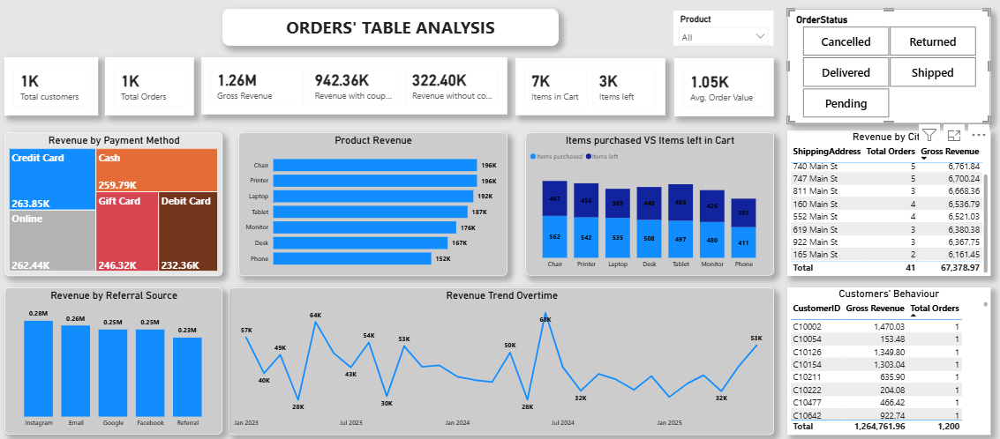

# E-Commerce Orders Analysis

*Internship Project* | Decodelab IT  
*Analyst:* Francis Blessing Osewayeme  
*Date:* June 2026

## Project Overview
This project involves end-to-end analysis of an e-commerce orders dataset. I cleaned the data, performed exploratory analysis using SQL, and built an interactive dashboard with Power BI.

## Objectives
- Clean and prepare raw e-commerce data
- Analyze key business metrics using SQL
- Visualize insights and create a professional dashboard
- Provide actionable business recommendations

## Tools & Technologies
- *Excel + Power Query* – Data Cleaning & Transformation
- *MySQL* – Exploratory Data Analysis (EDA)
- *Power BI* – Interactive Dashboard & Visualizations

## Key Insights
- Total Revenue: *≈ $1.26 Million*
- Instagram is the highest performing referral source
- Significant cart abandonment and order cancellation rates observed
- Top products and customer behavior identified

## Repository Structure
